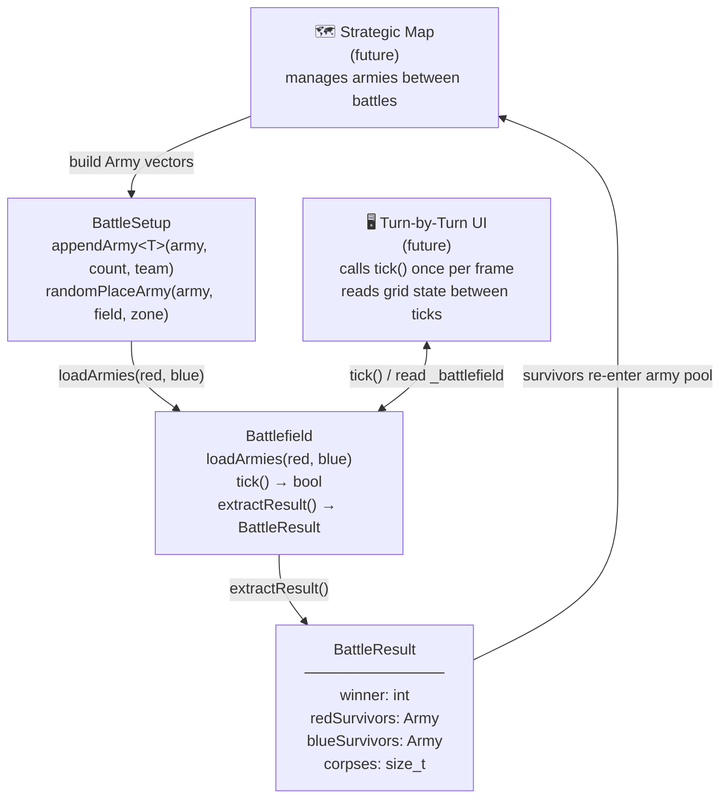
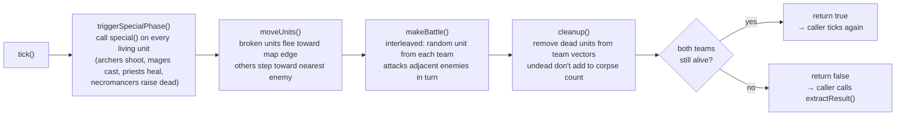
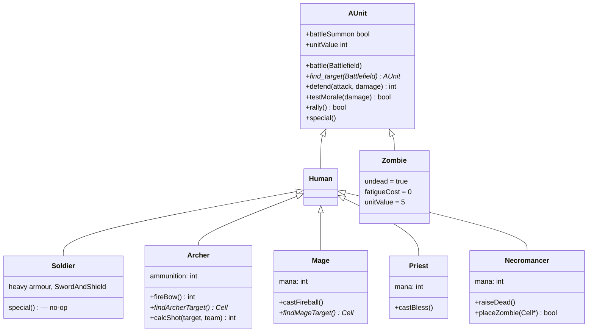
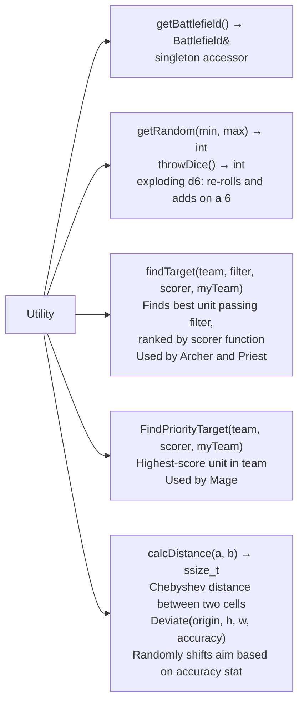
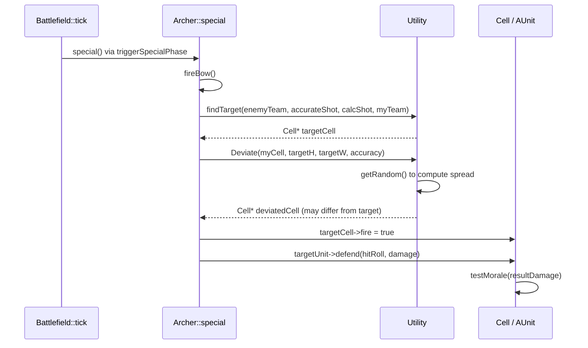

# Architecture

Diagrams use [Mermaid](https://mermaid.js.org/) syntax, rendered automatically by GitHub.

---

## System overview

The battle engine is the only completed subsystem. The strategic map and turn-by-turn UI are shown as future connection points so it's clear where the APIs need to extend.

> `Army = std::vector<std::unique_ptr<AUnit>>` is the transfer type across all boundaries.
> Units marked `battleSummon = true` (e.g. Necromancer zombies) are filtered out of survivors.

---

## What happens each tick

---

## Unit class hierarchy

---

## Utility services

`Utility` is accessed as a static/global throughout the engine. Everything that needs randomness, targeting math, or the battlefield singleton goes through here.

---

## Data flow: Archer firing (example)

A concrete walk-through of how a ranged attack crosses subsystem boundaries.

