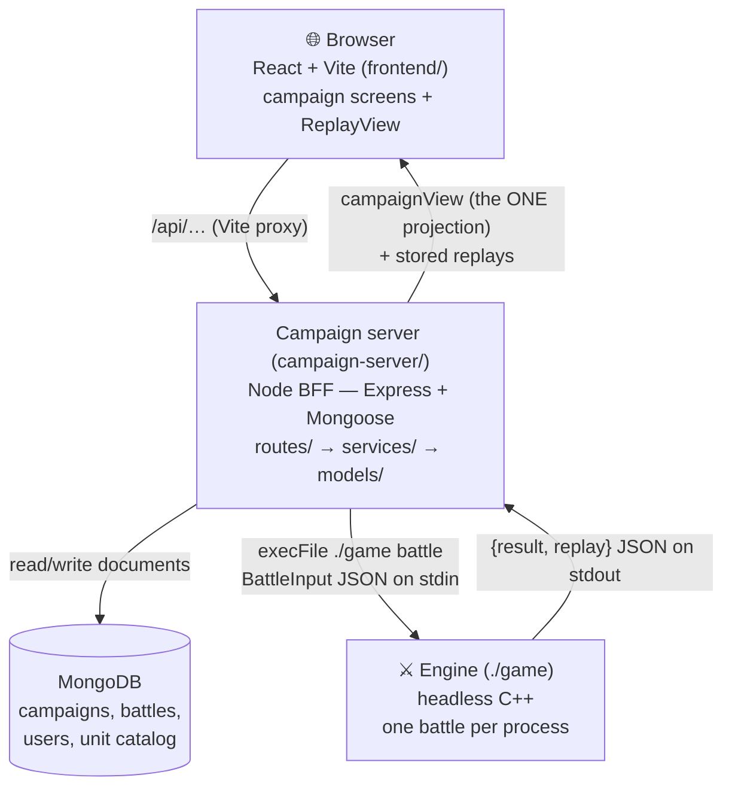
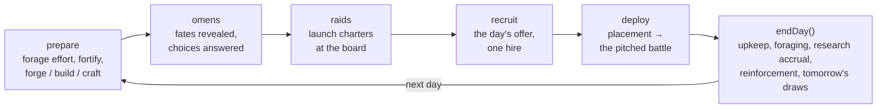
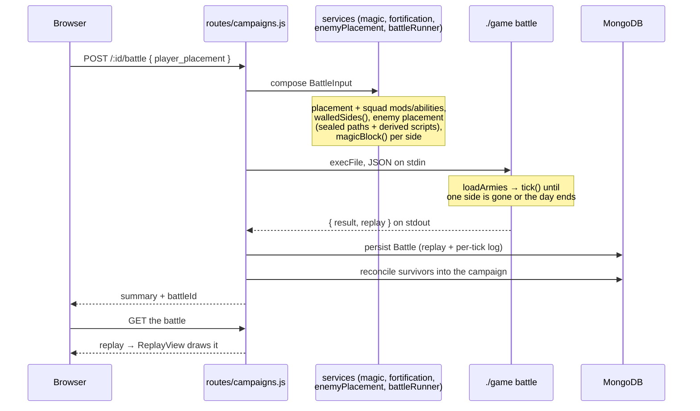
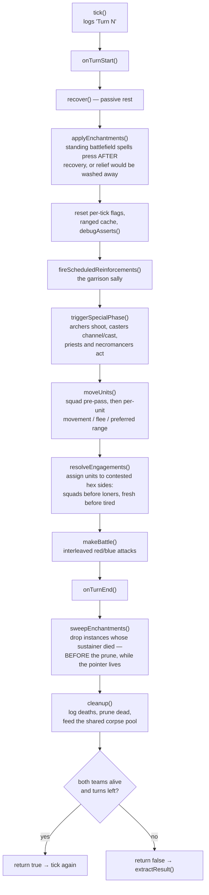
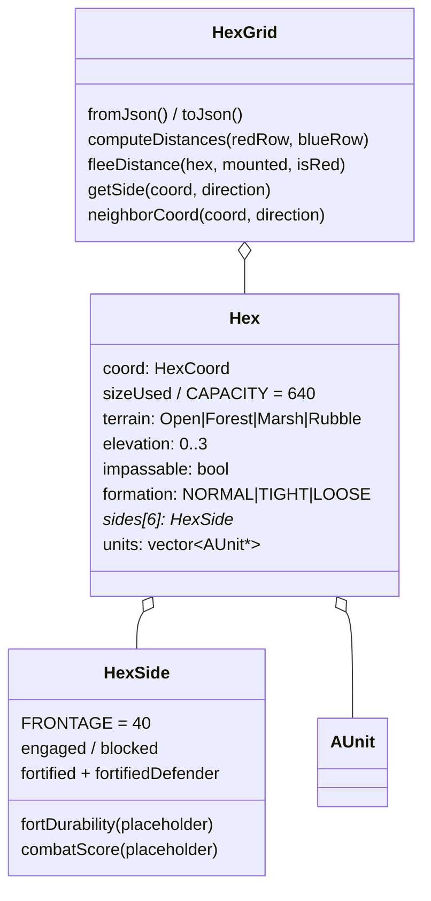
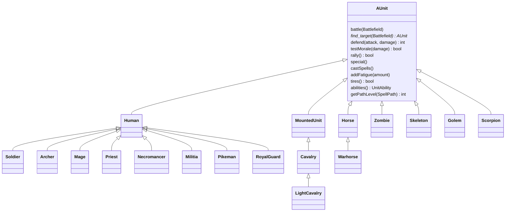
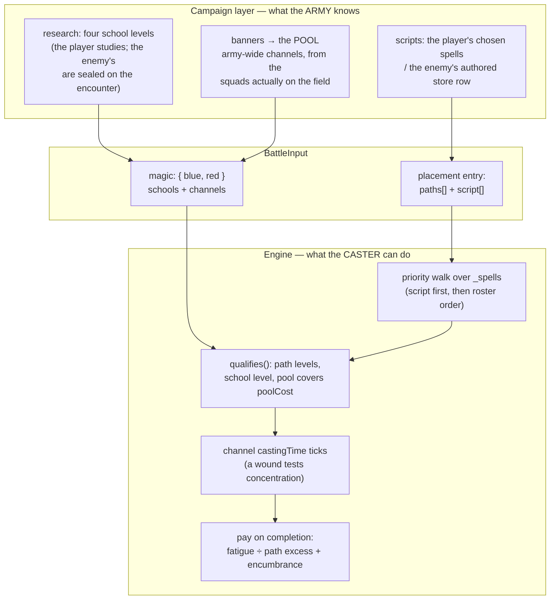
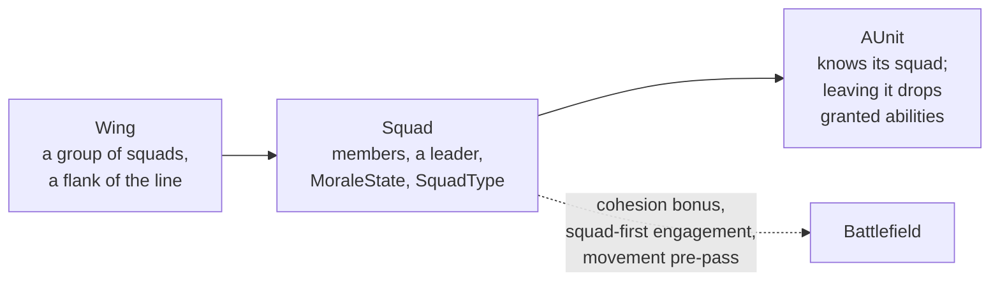
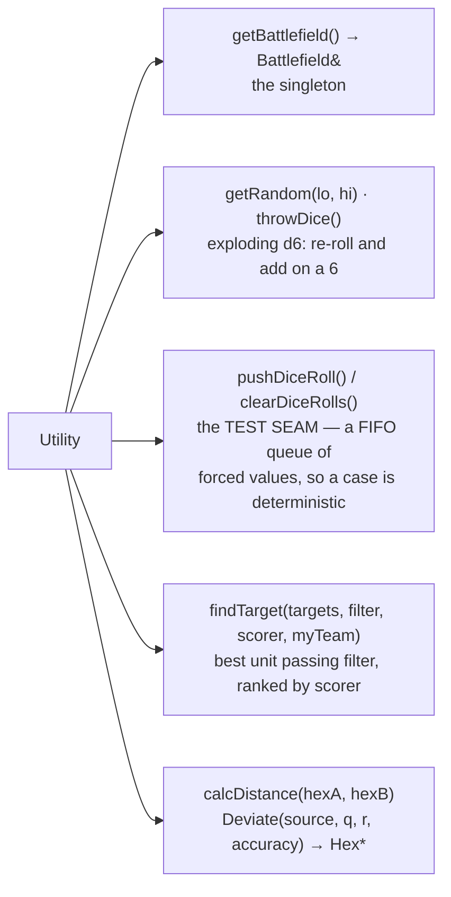
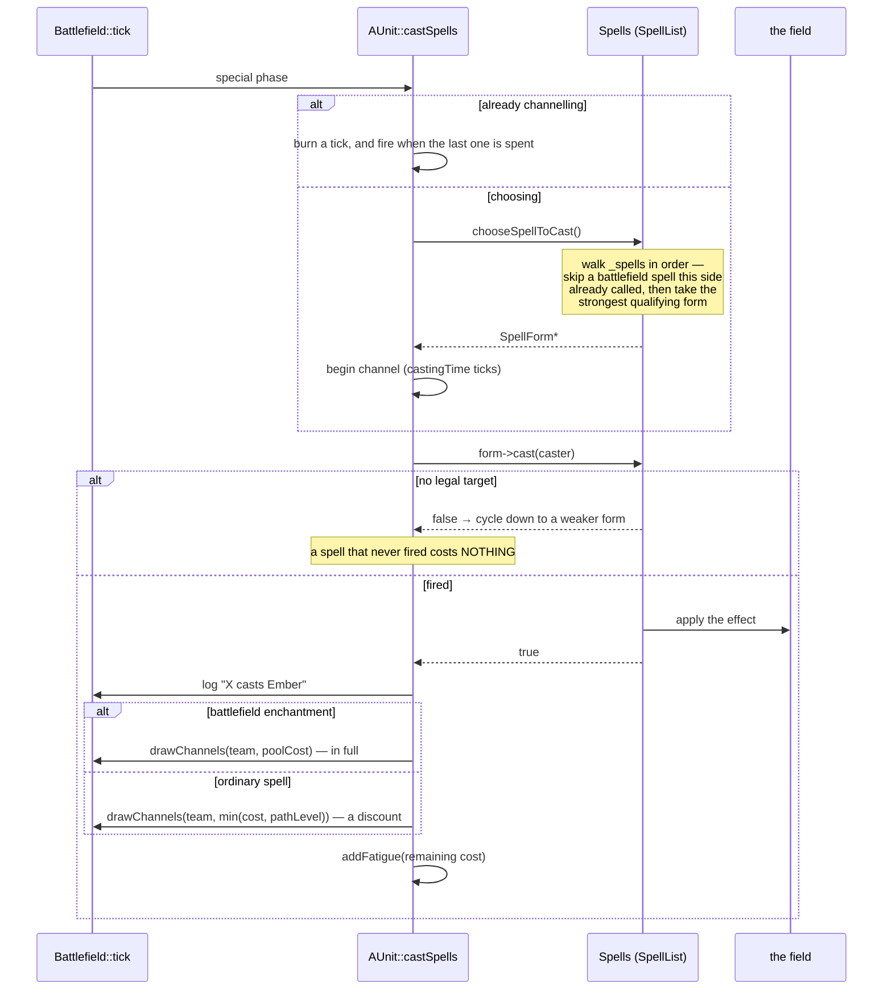

# Architecture

The shape of the system, in diagrams. Rewritten 2026-08-29 — the previous version described the
pre-hex, pre-magic engine and a campaign layer that was still hypothetical, and had drifted far
enough to mislead.

**What is authoritative, when this file and the code disagree:** the code, always. `CLAUDE.md`
holds build/test commands and the module boundaries; `docs/CAMPAIGN_PLAN.md` is the campaign
layer's decision record (every rule cited as M-*, S*-*, C-*, E-* lives there); `DESIGN.md`
describes the hex/formation/combat design, most of it still marked `[PLANNED]`. This file is the
map between them, and it is kept at the level of *what talks to what* — deliberately not a
field-by-field reference, because that is the kind of detail that rots first.

---

## System overview

Three processes and a database. The browser is the only renderer; the C++ engine is headless and
fights one battle per invocation.

```mermaid
flowchart TD
    B["🌐 Browser<br/>React + Vite (frontend/)<br/>campaign screens + ReplayView"]
    S["Campaign server (campaign-server/)<br/>Node BFF — Express + Mongoose<br/>routes/ → services/ → models/"]
    M[("MongoDB<br/>campaigns, battles,<br/>users, unit catalog")]
    E["⚔️ Engine (./game)<br/>headless C++<br/>one battle per process"]

    B -->|"/api/… (Vite proxy)"| S
    S -->|"read/write documents"| M
    S -->|"execFile ./game battle<br/>BattleInput JSON on stdin"| E
    E -->|"{result, replay} JSON on stdout"| S
    S -->|"campaignView (the ONE projection)<br/>+ stored replays"| B
```

Two rules this diagram exists to make visible:

- **The dependency runs campaign → engine, never back.** The engine knows nothing about
  recruiting, gold, research or turns. It is handed an army, a map and a few numbers, and it
  fights. Anything the campaign wants the engine to honour has to arrive inside `BattleInput`.
- **The client composes no rules.** `services/campaignView.js` is the single projection: it
  phrases every sentence and pre-answers every gate, so a screen renders what the server said
  rather than recomputing it (the rule is 17-5 in the plan).

`./game server` also exists — a thin `httplib` server, the original pre-campaign path. It is
**not** used by the campaign flow, Docker or CI. See `SECURITY_NOTES.md`.

---

## The campaign turn

The turn is a server-owned one-way march. Every mutating route asserts the phase it belongs to, so
the client cannot drive the turn out of order.

```mermaid
flowchart LR
    P["prepare<br/>forage effort, fortify,<br/>forge / build / craft"]
    O["omens<br/>fates revealed,<br/>choices answered"]
    R["raids<br/>launch charters<br/>at the board"]
    C["recruit<br/>the day's offer,<br/>one hire"]
    D["deploy<br/>placement →<br/>the pitched battle"]
    ED["endDay()<br/>upkeep, foraging, research accrual,<br/>reinforcement, tomorrow's draws"]

    P --> O --> R --> C --> D --> ED
    ED -->|"next day"| P
```

`TURN_PHASES` in `models/campaign.js` is the authority for that ladder; index order *is* the
forward-only rule. `services/dayResolution.js` owns `endDay()`.

---

## Running a battle

Both the pitched battle and a raid take the same pipeline — one battle is one engine process, and
the replay is persisted so the browser can play it back later.

```mermaid
sequenceDiagram
    participant FE as Browser
    participant RT as routes/campaigns.js
    participant SV as services (magic, fortification,<br/>enemyPlacement, battleRunner)
    participant EN as ./game battle
    participant DB as MongoDB

    FE->>RT: POST /:id/battle { player_placement }
    RT->>SV: compose BattleInput
    Note over SV: placement + squad mods/abilities,<br/>walledSides(), enemy placement<br/>(sealed paths + derived scripts),<br/>magicBlock() per side
    RT->>EN: execFile, JSON on stdin
    Note over EN: loadArmies → tick() until<br/>one side is gone or the day ends
    EN-->>RT: { result, replay } on stdout
    RT->>DB: persist Battle (replay + per-tick log)
    RT->>DB: reconcile survivors into the campaign
    RT-->>FE: summary + battleId
    FE->>RT: GET the battle
    RT-->>FE: replay → ReplayView draws it
```

**`BattleInput` is the trust boundary.** `backend/server/src/UnitRegistry.cpp` parses it with a
never-throw discipline: a malformed field is skipped, never rejected. Top level carries `map`,
`player_placement`, `enemy_placement`, `fortified_sides`, `reinforcements`, `max_turns` and
`magic`. A placement entry carries `unit_type`/`q`/`r` plus, optionally, `squad_id`,
`squad_name`, `squad_mods`, `squad_abilities`, `carried_abilities`, `denied_abilities`,
`avoids_melee`, `hold_turns`, `character_id`, `paths` and `script`.

The last two are worth naming: **the engine cannot tell whose caster it is holding.** Paths and a
chosen-spell script ride a placement entry identically for both sides — the player's from a
character sheet, the enemy's derived from the authored script store — which is what keeps one
magic system rather than two (M-17).

---

## What happens each tick

`Battlefield::tick()`. The two turn hooks are not decoration: the order inside them is load-bearing
and commented at both sites.

```mermaid
flowchart TD
    T["tick()<br/>logs 'Turn N'"] --> OS["onTurnStart()"]
    OS --> RC["recover() — passive rest"]
    RC --> AE["applyEnchantments()<br/>standing battlefield spells press AFTER<br/>recovery, or relief would be washed away"]
    AE --> RF["reset per-tick flags,<br/>ranged cache, debugAsserts()"]
    RF --> FR["fireScheduledReinforcements()<br/>the garrison sally"]
    FR --> SP["triggerSpecialPhase()<br/>archers shoot, casters channel/cast,<br/>priests and necromancers act"]
    SP --> MU["moveUnits()<br/>squad pre-pass, then per-unit<br/>movement / flee / preferred range"]
    MU --> RE["resolveEngagements()<br/>assign units to contested hex sides:<br/>squads before loners, fresh before tired"]
    RE --> MB["makeBattle()<br/>interleaved red/blue attacks"]
    MB --> OE["onTurnEnd()"]
    OE --> SW["sweepEnchantments()<br/>drop instances whose sustainer died —<br/>BEFORE the prune, while the pointer lives"]
    SW --> CL["cleanup()<br/>log deaths, prune dead,<br/>feed the shared corpse pool"]
    CL --> Q{"both teams alive<br/>and turns left?"}
    Q -->|yes| Y["return true → tick again"]
    Q -->|no| N["return false → extractResult()"]
```

> `Army = std::vector<std::unique_ptr<AUnit>>` is the transfer type across every boundary.
> Units with `battleSummon = true` (raised zombies, sally reinforcements) are filtered out of
> survivors, so nothing conjured mid-battle follows the army home.

---

## The hex grid

The battlefield is a hex grid, and **the sides between hexes are first-class objects** — that is
where fighting and fortification live, not on the hexes themselves.

```mermaid
classDiagram
    HexGrid o-- Hex
    Hex o-- HexSide
    Hex o-- AUnit

    class HexGrid {
        fromJson() / toJson()
        computeDistances(redRow, blueRow)
        fleeDistance(hex, mounted, isRed)
        getSide(coord, direction)
        neighborCoord(coord, direction)
    }
    class Hex {
        coord: HexCoord
        sizeUsed / CAPACITY = 640
        terrain: Open|Forest|Marsh|Rubble
        elevation: 0..3
        impassable: bool
        formation: NORMAL|TIGHT|LOOSE
        sides[6]: HexSide*
        units: vector~AUnit*~
    }
    class HexSide {
        FRONTAGE = 40
        engaged / blocked
        fortified + fortifiedDefender
        fortDurability (placeholder)
        combatScore (placeholder)
    }
```

- **A hex holds size-points, not a unit count** (`CAPACITY`), so one giant and forty men occupy
  the same space differently. `FormationLayout` decides where inside the hex each body stands, and
  is the single source of the positions `ReplayRecorder` writes into every tick.
- **`effectiveFrontage()`** shrinks a side in Forest and Rubble — terrain limits how many can
  fight across it, which is the frontage half of the design.
- `fortified_sides` from `BattleInput` is where the campaign's fortification level and standing
  constructions land. The engine never learns the words "fort" or "construction"; it is handed
  sides.

---

## Unit class hierarchy

Three roots under `AUnit`: men, mounts, and the things that are neither.

```mermaid
classDiagram
    AUnit <|-- Human
    AUnit <|-- MountedUnit
    AUnit <|-- Horse
    AUnit <|-- Zombie
    AUnit <|-- Skeleton
    AUnit <|-- Golem
    AUnit <|-- Scorpion

    Human <|-- Soldier
    Human <|-- Archer
    Human <|-- Mage
    Human <|-- Priest
    Human <|-- Necromancer
    Human <|-- Militia
    Human <|-- Pikeman
    Human <|-- RoyalGuard

    MountedUnit <|-- Cavalry
    Cavalry <|-- LightCavalry
    Horse <|-- Warhorse

    class AUnit {
        battle(Battlefield)
        find_target(Battlefield) AUnit*
        defend(attack, damage) int
        testMorale(damage) bool
        rally() bool
        special()
        castSpells()
        addFatigue(amount)
        tires() bool
        abilities() UnitAbility
        getPathLevel(SpellPath) int
    }
```

Cross-cutting descriptors, all of them data rather than subclasses — which is why new content is
usually a catalog row and not a class:

- **`UnitCategory`** — `Foot`, `Mounted`, `Flyer`, `Beast`, `Skirmisher`. Decides terrain costs and
  what a body may enter at all.
- **`UnitAbility`** — a composable bitflag set, today exactly `Fearless`, `Mindless`, `Undead` and
  `NoCorpse`, with an implication closure in `Abilities.hpp` so `Mindless ⇒ Fearless` and
  `Undead ⇒ NoCorpse` cannot be forgotten. A body carries four layers of it — innate, granted by
  its squad's banner, carried on its gear, and suppressed by gear — folded in `AUnit::abilities()`
  with denial applied *before* the closure, so a row denying an implied flag is legal to write and
  simply does nothing.
- **`UnitRole`** — `Player`, `Enemy`, `Summon`, `Mount`, `Crafted`: every channel through which a
  type may legitimately enter play. A `Player` type with no recruit row is a bug, and a `Crafted`
  type with no forge row is a bug; both are pinned by tests against the real binary
  (`docs/ADDING_UNITS.md` §5).

---

## The magic system

The largest subsystem after combat itself. Twenty-six decisions behind it (M-1..M-26 in the plan);
what follows is only the shape.

```mermaid
flowchart TD
    subgraph Campaign["Campaign layer — what the ARMY knows"]
        RS["research: four school levels<br/>(the player studies; the enemy's<br/>are sealed on the encounter)"]
        BN["banners → the POOL<br/>army-wide channels, from the<br/>squads actually on the field"]
        SC["scripts: the player's chosen spells<br/>/ the enemy's authored store row"]
    end
    subgraph Wire["BattleInput"]
        MG["magic: { blue, red }<br/>schools + channels"]
        PE["placement entry:<br/>paths[] + script[]"]
    end
    subgraph Engine["Engine — what the CASTER can do"]
        WK["priority walk over _spells<br/>(script first, then roster order)"]
        QF["qualifies(): path levels,<br/>school level, pool covers poolCost"]
        CH["channel castingTime ticks<br/>(a wound tests concentration)"]
        PAY["pay on completion:<br/>fatigue ÷ path excess + encumbrance"]
    end

    RS --> MG
    BN --> MG
    SC --> PE
    MG --> QF
    PE --> WK
    WK --> QF
    QF --> CH
    CH --> PAY
```

The pieces worth knowing before touching any of it:

- **Two gates, never one.** A caster's own `paths` (ten of them, levels 1–9) decide what *he* can
  cast; the army's `school` level decides what *exists* for that side. Holy and Unholy are granted
  rather than researched, so they carry `SpellSchool::None` and pass no school gate at all (M-14).
- **A spell has forms**, weakest first — usually `minor` and `major`. Selection takes the strongest
  form the caster qualifies for; if it fails at cast time (no legal target, no corpses) it cycles
  down through weaker forms rather than wasting the turn.
- **Fatigue is the cost and never a gate** (M-2/M-22). There is no affordability test: a caster may
  cast himself past the ceiling, where fatigue turns into wounds. The POOL — banner channels — can
  shave that cost, capped at the caster's primary path level.
- **Battlefield-wide enchantments** (E-2..E-6) are the one sustained kind: they cost `poolCost`
  drawn from the pool in full, may be cast once per side per battle, stand until their caster dies,
  and are **script-only** — deliberately absent from the default walk, so the fallback AI can never
  spend the army's pool or drop a self-harming curse on its own line.

`Spell.hpp` defines the vocabulary, `SpellList.cpp` holds the roster and every effect body, and
`./game dump-spells` exports the whole thing as JSON so the campaign server renders gates the
engine actually enforces. **To add a spell, see `docs/ADDING_SPELLS.md`.**

---

## Formation grouping: squads and wings

```mermaid
flowchart LR
    W["Wing<br/>a group of squads,<br/>a flank of the line"] --> S["Squad<br/>members, a leader,<br/>MoraleState, SquadType"]
    S --> U["AUnit<br/>knows its squad;<br/>leaving it drops<br/>granted abilities"]
    S -.->|"cohesion bonus,<br/>squad-first engagement,<br/>movement pre-pass"| BF["Battlefield"]
```

A squad is a real object in the engine, and the campaign's *charters* map onto it: a charter's
banner becomes `squad_abilities` on each placement entry, its upgrades become `squad_mods`. A unit
that breaks and flees leaves its squad, and so loses what the banner was granting — by leaving,
not by any strip step.

---

## Utility services

`Utility` is a static accessor used engine-wide for the things that would otherwise need threading
through every call.

```mermaid
flowchart LR
    U["Utility"]
    U --> BF["getBattlefield() → Battlefield&<br/>the singleton"]
    U --> RNG["getRandom(lo, hi) · throwDice()<br/>exploding d6: re-roll and add on a 6"]
    U --> MOCK["pushDiceRoll() / clearDiceRolls()<br/>the TEST SEAM — a FIFO queue of<br/>forced values, so a case is deterministic"]
    U --> TGT["findTarget(targets, filter, scorer, myTeam)<br/>best unit passing filter, ranked by scorer"]
    U --> MATH["calcDistance(hexA, hexB)<br/>Deviate(source, q, r, accuracy) → Hex*"]
```

The mock dice queue is the reason engine tests can assert exact outcomes. It is a FIFO shared by
everything that rolls, so a test that seeds more values than it consumes leaves them for the next
caller — a real bug class, and the reason `clearDiceRolls()` exists.

---

## Worked example: a caster casts

The most intricate current path, end to end — chosen in place of the old archer walk-through
because it crosses every boundary this document describes.

```mermaid
sequenceDiagram
    participant BF as Battlefield::tick
    participant AU as AUnit::castSpells
    participant SL as Spells (SpellList)
    participant FD as the field

    BF->>AU: special phase
    alt already channelling
        AU->>AU: burn a tick, and fire when the last one is spent
    else choosing
        AU->>SL: chooseSpellToCast()
        Note over SL: walk _spells in order —<br/>skip a battlefield spell this side<br/>already called, then take the<br/>strongest qualifying form
        SL-->>AU: SpellForm*
        AU->>AU: begin channel (castingTime ticks)
    end
    AU->>SL: form->cast(caster)
    alt no legal target
        SL-->>AU: false → cycle down to a weaker form
        Note over AU: a spell that never fired costs NOTHING
    else fired
        SL->>FD: apply the effect
        SL-->>AU: true
        AU->>BF: log "X casts Ember"
        alt battlefield enchantment
            AU->>BF: drawChannels(team, poolCost) — in full
        else ordinary spell
            AU->>BF: drawChannels(team, min(cost, pathLevel)) — a discount
        end
        AU->>AU: addFatigue(remaining cost)
    end
```
